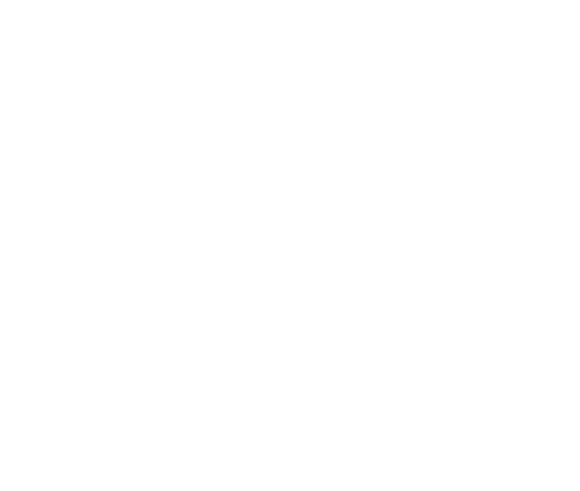

# Rio Bravo Financial Futmanager (Craques da Carteira)

 Rio Bravo Financial Futmanager (Craques da Carteira)
Jogo interativo de perfil de investidor em formato “futebol + carteira” para eventos. O jogador monta um time de ativos e concorre ao ranking do dia e a brindes.

## Pré-requisitos

- Node.js 18+
- npm

## Desenvolvimento

1. Instale as dependências:
   ```bash
   npm install
   ```

2. Suba o front (Vite) e a API (Express) juntos:
   ```bash
   npm run dev
   ```

3. Acesse o jogo pela URL do **Vite** (ex.: `http://localhost:5173`). O proxy envia `/api` para o servidor na porta 3000.

4. Para só rodar o servidor (sem front):
   ```bash
   npm run server
   ```
   (Útil se o front já estiver rodando em outro processo.)

## Build e produção

1. Gere o build e copie assets/estilos para `dist`:
   ```bash
   npm run build
   ```

2. Sirva a pasta `dist` e a API:
   ```bash
   node server.js
   ```

3. Acesse `http://localhost:3000` (ou a porta definida em `PORT`).

## Variáveis de ambiente

| Variável       | Descrição |
|----------------|-----------|
| `PORT`         | Porta do servidor (padrão: 3000). |
| `ADMIN_API_KEY`| (Opcional) Chave para proteger rotas de admin. Se definida, exige header `X-Admin-Key` ou `Authorization: Bearer <chave>` em POST `/api/config` e em POST/PATCH/DELETE `/api/prizes`. |

## API (resumo)

- `GET /api/config` – Configuração do jogo (ex.: tempo da partida).
- `POST /api/config` – Atualiza configuração (protegida se `ADMIN_API_KEY` estiver definida).
- `GET /api/prizes` – Lista prêmios.
- `POST/PATCH/DELETE /api/prizes` – CRUD de prêmios (protegido com `ADMIN_API_KEY`).
- `POST /api/award` – Registra fim de partida e possível prêmio (com rate limit).
- `GET /api/ranking` – Ranking do dia (com rate limit).

## Admin

O menu na tela inicial (tecla **M**) oferece atalho para `/admin.html`. O painel admin usa as rotas de prêmios e configuração; em produção, defina `ADMIN_API_KEY` e envie a chave no header nas requisições.

## Estrutura

- `src/main.js` – Lógica principal do jogo.
- `src/utils.js` – Funções utilitárias.
- `src/api.js` – Chamadas à API (assets, award).
- `server.js` – Servidor Express (API + servir `dist`).
- `data/` – JSON de jogos, prêmios e configuração (gerados em runtime).
- `styles/`, `assets/` – CSS e imagens; copiados para `dist` no build.

### Configuração das cartas (posição por tipo de carteira)

Em `src/cards.json`, cada ativo pode ter um objeto **`positions`** com a posição ideal (Defesa, Meio de campo, Ataque) para cada tipo de carteira do jogador:

```json
{
  "id": 1,
  "name": "Rio Bravo Liquidez",
  "type": "Crédito",
  "suitability": 0.5,
  "desc": "...",
  "positions": {
    "CONSERVADOR": "Defesa",
    "MODERADO": "Defesa",
    "ARROJADO": "Defesa"
  }
}
```

- Se **`positions`** estiver definido, o jogo usa essa posição ideal por perfil (como na tabela de ativos).
- Se **`positions`** for omitido, a posição é calculada pela fórmula baseada em `suitability` (comportamento anterior).
- Valores aceitos: `"Defesa"`, `"Meio de campo"`, `"Ataque"` (ou em inglês: defense, midfield, attack).
